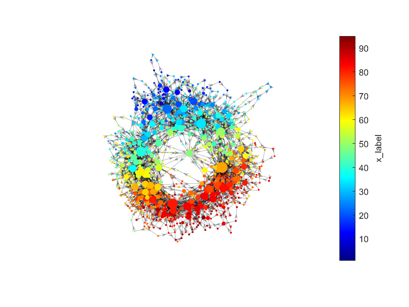

# Temporal Mapper 2
Here is **Temporal Mapper 2** developed by Mengsen Zhang. This version improves upon the original toolbox by adding a few new parameters to accommodate application across disciplines and data types. While the [original Temporal Mapper](#previous-versions) was designed for fMRI data, it turns out to be also useful to understanding dynamics in other systems and modalities. Thus, Temporal Mapper is designed to be a more general-purpose tool for characterizing complex dynamics. 

## How does it work
Technical details can be found in [the paper](#citation). Briefly, Temporal Mapper is designed to capture attractor (stable state) and phase transitions in high-dimensional dynamical systems as an attractor transition network from only time series data. In the transition network, each node represent an attractor. The weight of the node indicates the local stability of the attractor. Each edge reflect an transition from one attractor to another. The computation takes two steps:

### Step 1: construct spatiotemporal neighborhood graph
You will first need a distance matrix `D` which gives the pairwise distance between every two time points. `k` is the maximal number of spatial neighbors each time point will have. `tidx` is integer indices of each time point. By calling the function below, you will get a directed graph `g`, where each node is a time point. This is the spatiotemporal neighborhood graph. 

```Matlab
g = tknndigraph (D,k,tidx);
```
If you just have the time series `X` (rows: time points, columns: state variables), you can get Euclidean distance matrix `D` as below.
```
D = pdist2(X,X);
```

### Step 2: simplified transition network
In a second step, time points that are closely connected to each other (within a distance `d`) in the spatiotemporal neighborhood graph `g` get contracted to a single node. 

```Matlab
[g_simp, members] = filtergraph(g,d);
```
You will get the simplied graph `g_simp` as the attractor transition networks. `members` tell you which time points is mapped to each node. 

## Visualization
Once you have the graph, you can plot it with `plottmgraph` as below. To make it more interest, you want to have a coloring variable `colorvar`, which assigns each time point a scaler value (this could be simply one of the state variables.) 

```Matlab
figure;
plottmgraph(g_simp,colorvar,members);
```
You will get some that look like this.


You can follow the [full tutorial code](tmapper_demo.m) to generate this picture yourself!

## Dependencies
The code has been tested on MATLAB 2024a.

## Citation
If you have used the code for your project, please cite:

Zhang, M., Chowdhury, S., & Saggar, M. (2023). [Temporal Mapper: transition networks in simulated and real neural dynamics](https://doi.org/10.1162/netn_a_00301). *Network Neuroscience*, 7 (2): 431–460.

## Previous versions

The original version of the Temporal Mapper can be found [here](https://github.com/Multiscale-Complex-Systems-Lab/tmapper/).