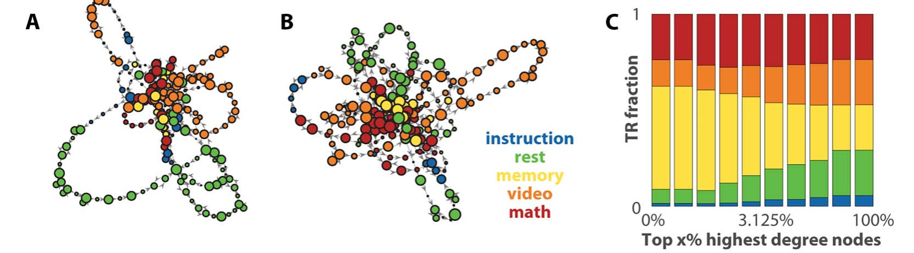
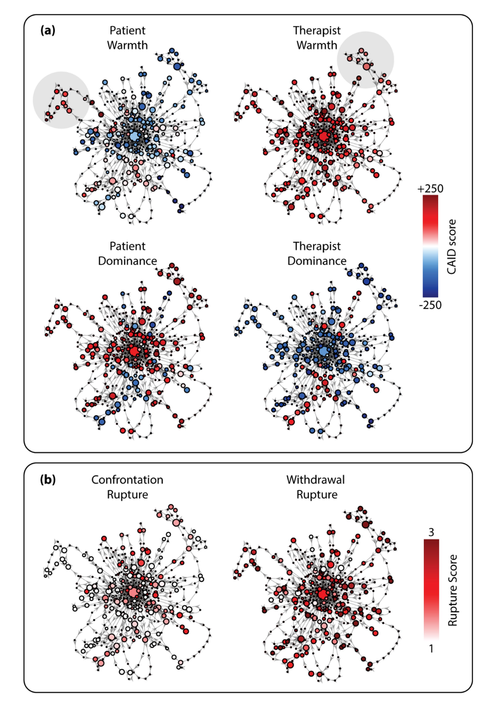
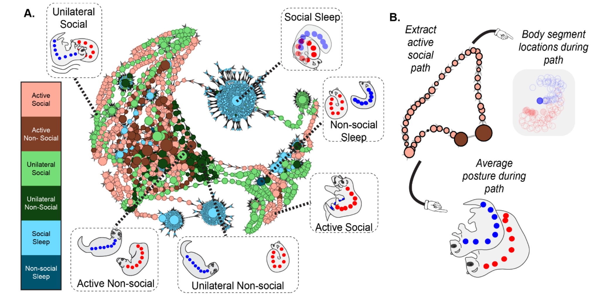

# Applications

Temporal Mapper was born as a tool for brain dynamics, but nothing in its construction is
specific to neuroscience — it needs only a multivariate time series with distinguishable
stable states. This page collects the applications so far — spanning brain activity, human
social interaction, and animal behavior — and what they show. For the underlying ideas, see
[Concepts](concepts.md).

## Brain dynamics

The method was introduced and validated in *Network Neuroscience*.[^zhang2023]

**Simulated neural dynamics (ground-truth validation).** The authors drove a biophysical
network model of 66 brain regions (a reduced Wong–Wang / Wilson–Cowan model) through a
sequence of phase transitions by slowly varying a global coupling parameter `G`. Because
the model's equations are known, they could compute the *true* attractor transition
network and check Temporal Mapper against it. Reconstructed from the simulated time series
alone, the network closely approximated the ground truth — and did so better than dynamic
functional connectivity (dFC) or raw BOLD, especially in capturing the asymmetric,
path-dependent structure that reflects the underlying dynamics.

**Human fMRI (empirical relevance).** Applied to 18 subjects in a continuous multitask
experiment — alternating blocks of rest, working memory, math, and video — Temporal Mapper
(`k = 5`, `d = 2`) produced transition networks whose structure tracked the task blocks.
The cognitively demanding tasks (memory and math) dominated the highest-degree, central
nodes, while rest and video dominated the long cycles out on the periphery. Strikingly,
these features were *behaviorally predictive*: how sharply a subject's network separated
demanding from undemanding tasks predicted their accuracy, reaction time, and missed
trials, and the abundance of intermediate-length cycles tracked slower reactions.

{ width="820" }
/// caption
Transition networks from two subjects' fMRI in a continuous multitask experiment, with nodes
colored by the dominant task (A, B), alongside the fraction of each task among the top-x%
highest-degree nodes (C) — memory and math dominate the central, high-degree nodes. *Adapted
from Zhang, Chowdhury & Saggar (2023), Figure 5 ([CC BY 4.0](https://creativecommons.org/licenses/by/4.0/)).*
///

## Social and interpersonal dynamics

The most recent application moves Temporal Mapper out of the brain entirely, to the
back-and-forth between two people in psychotherapy.[^luo2026]

Here the "state" is a four-dimensional **dyadic interpersonal state** — the warmth and
dominance of both patient and therapist, rated moment-to-moment (every half second) from
session video using the Continuous Assessment of Interpersonal Dynamics. From these four
time series, Temporal Mapper (`k = 7`, `d = 3`) builds one transition network per session,
whose nodes are recurring interpersonal configurations and whose loops are excursions away
from them and back.

Reading the networks with the same vocabulary as the brain work — node size as local
stability, loop length as global stability — the study found a clean and clinically
meaningful pattern:

- **Therapist warmth stabilizes.** Higher therapist warmth co-occurred with larger nodes
  (more locally stable interpersonal states) within sessions, and warmer sessions had
  shorter loops (more globally stable, less diverse states) across sessions.
- **Confrontation ruptures cut both ways.** States with high confrontation were *locally*
  stable within a session (larger nodes — the dyad dwelt there), yet sessions with more
  confrontation were *globally* less stable across sessions (smaller average nodes, longer
  loops), pushing the dyad to explore a more diverse range of interpersonal states. The
  authors interpret such states as **saddles** — attracting locally while repelling toward
  new territory.
- **Withdrawal ruptures were essentially invisible** to the network features — consistent
  with clinical accounts of withdrawal as a diffuse "stalling" rather than a system-level
  reorganization.

{ width="620" }
/// caption
An interpersonal state transition network for a single therapy session, built from the CAID
time series alone. Nodes are colored by the average interpersonal-circumplex scores (a —
patient and therapist warmth and dominance) and by average confrontation and withdrawal
rupture (b). *Adapted from Luo & Zhang (2026), Figure 2 ([CC BY](https://creativecommons.org/licenses/by/4.0/)).*
///

This study is also a template for the broader point: because Temporal Mapper is agnostic
to what the variables *mean*, the same pipeline applies to affective processes, linguistic
or physiological signals, and other multimodal streams — anywhere a system dwells in states
and occasionally switches between them.[^luo2026]

## Naturalistic animal behavior

The newest application (a preprint) pushes Temporal Mapper into naturalistic animal
behavior — the free social interaction of two domestic ferrets.[^reiling2026] Here the
"state" is **posture**: eight body segments per animal were tracked from video with
DeepLabCut and turned into *relative*-posture features (the distance, velocity, and angle
between the two ferrets' body segments). Temporal Mapper builds one **posture transition
network** per session (12 sessions; `k = 10`, `d = 3`), with nodes colored by six
human-annotated behavioral categories — active, unilateral, or sleep, each social or
non-social.

Read with the familiar vocabulary — node size as dwell time, geodesic distance and connected
components for global structure — the networks show that social behavior is **briefer and
more widely distributed** than non-social behavior:

- **Social states are widespread; non-social states are central.** Active-social and
  unilateral-social nodes populate the periphery of the network while non-social nodes
  cluster near the center; quantified by geodesic recurrence, social states sit farther apart.
- **Social postures are briefer.** Active-social nodes are significantly smaller (less dwell
  time) than active-non-social nodes — animals linger less in any one social posture.
- **Social sequences are consistent but disconnected.** Social sub-networks break into more
  connected components (more separate short paths), and unilateral-social path lengths are
  more consistent across sessions than their non-social counterparts.

Together: social activity is a broad range of brief, unstable postural states arranged in
consistent sequences — structure that time-averaged behavioral measures would miss. It is
also a clean demonstration that the same pipeline built for brain and interpersonal data
transfers directly to pose-estimation data in another species.

{ width="880" }
/// caption
A posture transition network for one ferret session (A), built from DeepLabCut pose-tracking
alone; nodes are postural states colored by behavioral category and sized by dwell time —
social states (salmon/green) spread to the periphery while non-social states cluster centrally.
(B) An active-social path extracted from the network, and the average posture along it.
*Adapted from Reiling et al. (2026), Figure 3 ([CC BY 4.0](https://creativecommons.org/licenses/by/4.0/)).*
///

## Using it on your own data

The [sample data](quickstart.md) shipped with the toolbox — historical East Lansing weather
— is itself a non-neural example, included precisely to show that the method is general.
To apply Temporal Mapper to your own system, arrange your data as rows = time points and
columns = state variables, build a distance matrix, and run the two-step pipeline described
in the [Quickstart](quickstart.md).

## References

[^zhang2023]: Zhang, M., Chowdhury, S., & Saggar, M. (2023). Temporal Mapper: transition networks in simulated and real neural dynamics. *Network Neuroscience, 7*(2), 431–460. <https://doi.org/10.1162/netn_a_00301> (CC BY 4.0)
[^luo2026]: Luo, X., & Zhang, M. (2026). A topological data analysis method for revealing dynamic changes in psychotherapy microprocesses. *Frontiers in Psychology, 16*, 1711782. <https://doi.org/10.3389/fpsyg.2025.1711782> (CC BY)
[^reiling2026]: Reiling, J., Padilla-Coreano, N., Patel, D., Frohlich, F., & Zhang, M. (2026). Topological data analysis captures complex behavioral dynamics during naturalistic social interaction between domestic ferrets. *bioRxiv* 2026.07.01.735818 (preprint). <https://doi.org/10.64898/2026.07.01.735818> (CC BY 4.0)
