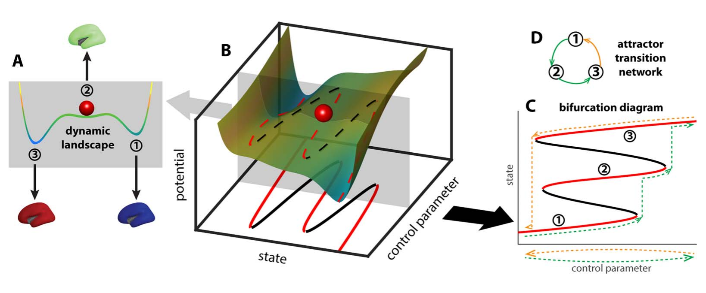
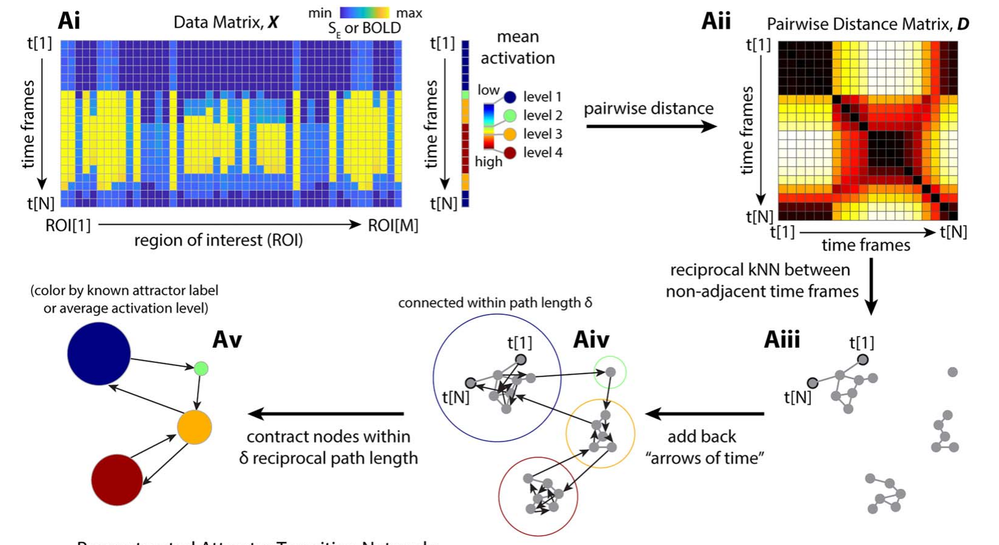

# Concepts

This page explains the ideas behind Temporal Mapper: what an *attractor transition
network* is, how the two-step construction works, and how to read the parts of the
network you see in the [Quickstart](quickstart.md). For the day-to-day mechanics of
running the toolbox, see the Quickstart; this page is the "why."

Temporal Mapper takes a multivariate time series and returns a directed graph — the
**attractor transition network** — whose nodes are the stable states a system settles
into and whose edges are the transitions between them. It was designed to bridge two
traditions that rarely meet: *data-driven* analysis (which asks only for the recorded
time series) and *mechanistic* dynamical-systems modeling (which writes down equations
of motion). Temporal Mapper stays agnostic about the underlying equations, yet its
nodes and edges are meant to correspond to the attractors and phase transitions of the
system that produced the data.[^zhang2023]

## The dynamic landscape

A useful mental picture is a ball rolling on a landscape (the surface is the system's
state space; the ball is its current state). Valleys are **attractors** — stable states,
because a ball nudged away from the bottom rolls back. The steepness of a valley is the
attractor's **local stability**. A system with several valleys is **multistable**.

The landscape is not fixed. A slowly changing *context* — called a **control parameter**
— deforms it. As a valley flattens and disappears, its attractor is destabilized and the
ball must roll to a new valley: a **phase transition**. Because the landscape can take
different shapes on the way "up" versus "down" a control parameter, the sequence of
attractors visited can be path-dependent — a property called **hysteresis**, which is
why the network is *directed*.[^zhang2023]

{ width="720" }
/// caption
The dynamic landscape (A) deforms as a **control parameter** changes (B), creating and
destroying attractors through bifurcations (C); the path-dependent sequence of visited
attractors is summarized as a directed **attractor transition network** (D). *Adapted from
Zhang, Chowdhury & Saggar (2023), Figure 1 ([CC BY 4.0](https://creativecommons.org/licenses/by/4.0/)).*
///

## From a time series to a network

The construction takes two steps.

### Step 1 — the spatiotemporal neighborhood graph

Treat the time series as a cloud of points, one per time point, in the space of your
state variables. Temporal Mapper builds a **spatiotemporal k-nearest-neighbor (STKNN)
graph** on these points:[^luo2026]

- **Spatial edges** connect points that are close in state space — specifically,
  *reciprocal* k-nearest neighbors (each is among the other's `k` closest), which is more
  robust to varying local density than plain kNN.
- **Temporal edges** connect each time point to the next, as *directed* edges. This is
  the **arrow of time**, and it is what makes Temporal Mapper a *dynamical* method rather
  than an ordinary point-cloud analysis.

Why the arrow of time matters: at a phase transition the system jumps between attractors
very fast, so consecutive samples land far apart in state space even though they are
directly linked in the dynamics. Spatial proximity alone would miss that link — exactly
at the moments of greatest interest. Adding temporal edges restores it, and it means the
**path length between two nodes carries dynamical, not merely geometric, information**:
the shortest path from x to y is a path of least "action" through the landscape, and
(because the graph is directed) it need not equal the path from y to x.[^zhang2023]

{ width="760" }
/// caption
The construction pipeline: the data matrix (Ai) yields a pairwise **distance matrix** (Aii);
reciprocal k-nearest neighbors between non-adjacent time frames form the spatial graph
(Aiii); the **arrows of time** are added back as directed edges (Aiv); and nodes within a
path length δ are contracted into the final transition network (Av). *Adapted from Zhang,
Chowdhury & Saggar (2023), Figure 3A ([CC BY 4.0](https://creativecommons.org/licenses/by/4.0/)).*
///

### Step 2 — contraction into the transition network

The STKNN graph has one node per time point, which is far too fine. In the second step,
time points that sit within a distance `d` of each other are **contracted** into a single
node. Here `d` is measured as the **shortest path length** in the STKNN graph — roughly,
the minimal number of time steps needed to get from one state to the other — so a larger
`d` merges more and yields a coarser, more compressed network.[^luo2026] The result is the
attractor transition network.

Because `d` is a scale knob, Temporal Mapper is naturally **multiscale**: the same data
can be viewed as a family of networks at increasing `d`, with small recurrent excursions
progressively absorbed into single nodes.[^zhang2023]

## Reading the network

Once you have a network, four features carry most of the meaning:

| Dynamical-systems idea | In the network | What it tells you |
| --- | --- | --- |
| Attractor (stable state) | **Node** | A state the system keeps returning to |
| Local stability | **Node size** | Total *dwell time* — how long the system stays there; bigger = a stronger, "deeper" attractor |
| Transition | **Edge** (directed) | A sudden switch from one state to a qualitatively different one; the arrow is the direction of time |
| Series of transitions back to a state | **Loop / cycle** | The process by which a state recurs |
| Global stability | **Loop length** | How many transitions it takes to leave a state and return; longer loops = *less* global stability |

(The node-size and loop-length mapping follows Luo & Zhang, 2026, Table 1.[^luo2026])

A helpful distinction is **local vs. global** dynamics. Node size is *local*: it is about
one attractor on a short timescale. Loop length is *global*: it concerns how the whole
repertoire of attractors is connected and how hard it is to move around it, which shows up
over longer timescales.[^luo2026]

### Source-like and sink-like nodes

Because edges are directed, a node can be more of a **source** (easy to leave, hard to
get back to) or a **sink** (easy to reach, hard to leave). Averaging the network's
geodesic distances by row versus column gives a *source distance* and a *sink distance*
for each moment; their difference flags source-like vs. sink-like states, which in the
fMRI study marked the entry and exit of cognitively demanding task blocks.[^zhang2023]

### The recurrence plot

The recurrence plot that appears alongside the network is an N×N image whose (i, j) entry
is the distance between the states at times i and j. Crucially, for Temporal Mapper this
distance is the **shortest path length in the network** (a dynamics-aware, generally
asymmetric quantity), not the Euclidean distance between raw states — which is why it
reveals structure that a classical recurrence plot does not.[^zhang2023]

## When does it work?

Temporal Mapper assumes a **separation of timescales**: transitions between states (the
"escape") must be fast compared with the slow drift *within* a state (the "dwell"). When
data show this **dwell–escape** character, stable states appear as nodes and switches
appear as edges. If states blur into each other without distinct dwelling, the network is
less meaningful.[^luo2026]

## Relationship to other methods

- **Hidden Markov models (HMMs):** an HMM fixes the number of states *a priori* and assumes
  the Markov property; Temporal Mapper's analog — the number of attractors visited — is
  *data-driven*, and it makes no Markov assumption, which suits non-stationary systems.[^zhang2023]
- **Mapper / NeuMapper and other TDA:** these treat a time series as a static point cloud
  and discard the sequence; Temporal Mapper's defining move is to fold in the arrow of
  time.[^zhang2023]
- **Comparing whole networks:** because two networks can have different numbers of nodes,
  comparing them is a graph-matching problem. Temporal Mapper uses the **Gromov–Wasserstein
  distance** from optimal transport, which compares full structure without a pre-specified
  node correspondence.[^zhang2023]

## Parameters at a glance

The [Quickstart](quickstart.md) shows these in code; briefly:

- **`k`** — spatial neighborhood size in the STKNN graph (larger `k` → denser graph).
- **`d`** — contraction distance in Step 2 (larger `d` → coarser network).
- **`texclude`** (`timeExcludeRange`) — how many neighboring time points count as temporal
  (and are therefore barred from being spatial) neighbors.
- **`maxNeighborDist` / `maxNeighborDistPrct`** — absolute and percentile caps on how far
  apart two points may be and still be called neighbors (the stricter one wins).

A practical rule from both studies: choose `k` and `d` in a range where the network is
**stable to small parameter changes**; increasing either one simplifies the graph. For a
sense of scale across domains: the fMRI study used `k = 5`, `d = 2`; the interpersonal
psychotherapy study `k = 7`, `d = 3`; and the ferret-behavior study `k = 10`,
`d = 3`.[^zhang2023][^luo2026][^reiling2026]

## References

[^zhang2023]: Zhang, M., Chowdhury, S., & Saggar, M. (2023). Temporal Mapper: transition networks in simulated and real neural dynamics. *Network Neuroscience, 7*(2), 431–460. <https://doi.org/10.1162/netn_a_00301> (CC BY 4.0)
[^luo2026]: Luo, X., & Zhang, M. (2026). A topological data analysis method for revealing dynamic changes in psychotherapy microprocesses. *Frontiers in Psychology, 16*, 1711782. <https://doi.org/10.3389/fpsyg.2025.1711782> (CC BY)
[^reiling2026]: Reiling, J., Padilla-Coreano, N., Patel, D., Frohlich, F., & Zhang, M. (2026). Topological data analysis captures complex behavioral dynamics during naturalistic social interaction between domestic ferrets. *bioRxiv* 2026.07.01.735818 (preprint). <https://doi.org/10.64898/2026.07.01.735818> (CC BY 4.0)
