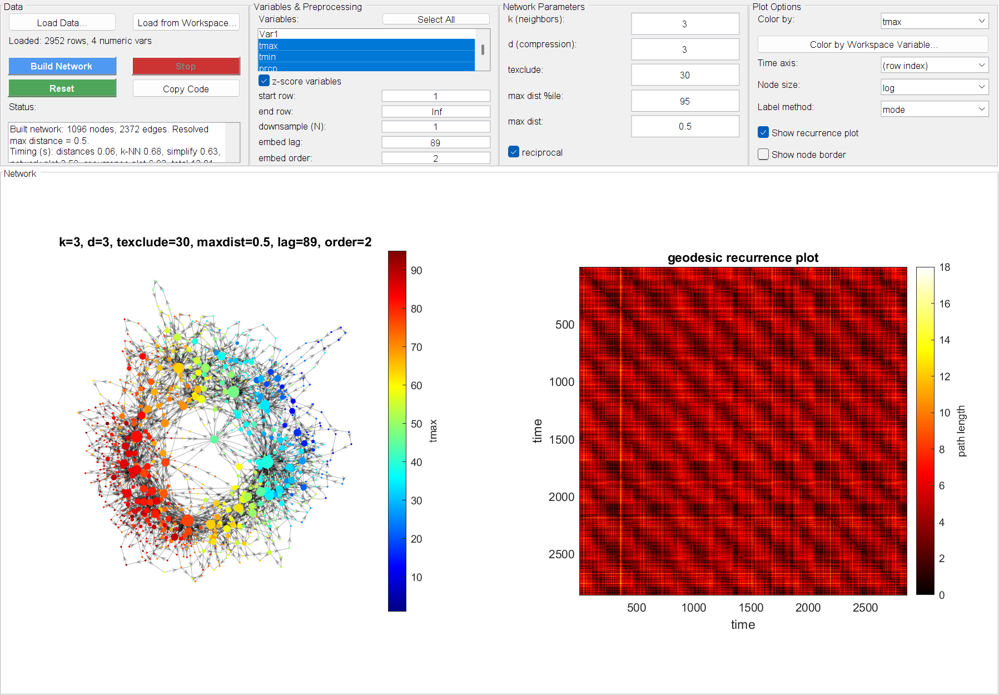

# Interactive App

`gui/TemporalMapperApp.m` is a point-and-click alternative to the scripted
pipeline in the [Quickstart](quickstart.md) — load data, pick variables, set
parameters, and view the resulting network without writing any code. It wraps
exactly the same two-step pipeline (`tknndigraph` → `filtergraph`) and the same
plotting functions (`plottmgraph`/`plotgraphtcm`) described elsewhere in these
docs, so everything in [Concepts](concepts.md) about what the parameters mean
still applies.


/// caption
The same East Lansing weather dataset and parameters as the
[Quickstart](quickstart.md), built through the app instead of the command
line.
///

## Launch it

```matlab
addpath("tmapper_tools/")
addpath("gui/")
app = TemporalMapperApp;
```

## Layout

The window is split into two parts: four **Setup** panels across the top, and
the **Network**/recurrence plots filling the rest of the window.

### Data

Load a data file (`.csv`/`.txt`, read with `readtable`) or a table/numeric
matrix already sitting in your base workspace. Only numeric columns are
offered as build variables. This panel also holds **Build Network**, **Stop**
(cancels an in-progress build — see [below](#stop-cancels-between-not-mid-stage)),
**Reset** (restores every parameter to its default, but leaves your loaded
data and variable selection alone), **Copy Code**, and a live **Status** box
with per-step timing once a build finishes.

### Variables & Preprocessing

- **Variables** — the numeric columns to build the network from (⌘/Ctrl/Shift-click for multiple; **Select All** as a shortcut). A leading unnamed row-index column is dropped automatically — see [below](#missing-data-and-downsampling).
- **z-score variables** — on by default; see the Quickstart's [note on why](quickstart.md#step-1-load-and-select-the-data).
- **start row / end row** — restrict the build to a sub-range of the loaded data. `end row = Inf` means "the last row."
- **downsample (N)** — keep every Nth row. A moving-average lowpass is applied first so this doesn't alias high-frequency content into spurious low-frequency structure — see [below](#missing-data-and-downsampling).
- **embed lag / embed order** — optional [delay embedding](quickstart.md#step-2-optional-delay-embedding); order `1` (default) skips it.

### Network Parameters

The four `tknndigraph`/`filtergraph` parameters explained in the
[Quickstart](quickstart.md#step-4-build-the-spatiotemporal-graph) and
[Concepts](concepts.md): **k**, **d** (labeled "compression"), **texclude**,
the two **max dist** cutoffs, and **reciprocal**.

### Plot Options

Color/time axis variable, node size mode, label method, and whether to show
the recurrence plot / a node-border scatter overlay. Changing any of these
**re-renders the existing network instead of rebuilding it** — cheap, and
safe to click through freely once a build has completed.

!!! note "Date columns"
    `readtable` turns a date column into `datetime` automatically, and those
    columns are offered for **Color by** and **Time axis** — so the GUI can
    reproduce `tmapper_demo.m`'s own `t = dat.Date` axis, with the recurrence
    plot labelled in real dates rather than row numbers.

    They stay out of **Variables**, though: distances need real numbers. For
    colouring, a date is converted with `datenum` (a colormap needs numbers,
    and `plottmgraph` calls `isnan` on the colour variable, which errors on
    `datetime`); the time axis keeps the `datetime` as-is, since `imagesc`
    takes it natively.

## Missing data and downsampling

Several things the scripted pipeline leaves to you are handled automatically
here:

!!! note "A stray row-index column is dropped"
    Writing a CSV without suppressing the index leaves an unnamed first
    column, which `readtable` names `Var1`. It is just a monotonic ramp, so
    leaving it selectable — and selected by default — would silently
    dominate the distance computation. It is dropped on load and the status
    area says so.

    `Var1` is a weaker signal than it looks, since MATLAB also auto-names
    every column of a genuinely header-less file, so the check additionally
    requires that some *other* column is properly named and that the column
    really does look like a row index (numeric and strictly increasing).
    A `Var1` holding real data is kept.

!!! note "Missing data is handled, not ignored"
    A missing value in any selected variable is never passed through to the
    pipeline — an unremoved `NaN` would poison the entire distance matrix
    without any visible error. Calling `tknndigraph`/`plottmgraph` directly
    on unclean data still raises an error, per the usual `rmmissing`-first
    convention.

    At `downsample (N) = 1` a row with any missing selected variable is
    dropped, leaving a real gap in time. When downsampling, each kept sample
    is an average over its window and that average simply skips missing
    inputs — so an isolated `NaN` costs no sample at all, and only a sample
    whose entire window is missing is dropped. The status area reports the
    count either way.

!!! note "Downsampling anti-aliases first"
    Setting `downsample (N) > 1` applies a moving-average lowpass over a
    window of size N before striding, rather than naively picking every Nth
    raw row.

    Decimation runs on the **original** row grid, never on the rows left
    after missing-data removal. Striding the survivors would slide every
    later sample off the true time grid, inventing gaps between samples that
    were in fact evenly spaced.

!!! note "Real gaps stay gaps in time"
    `tknndigraph`'s `tidx` argument is what tells the pipeline which samples
    are *temporally* adjacent — it links two points only when their `tidx`
    differs by exactly 1. The app derives `tidx` from elapsed position rather
    than array position, so a genuine break in the data (a dropped row, or a
    restricted row range) leaves a jump and no temporal edge is fabricated
    across it.

## Stop cancels between, not mid-stage

**Stop** requests cancellation, but MATLAB callbacks run synchronously, so it
only takes effect at the boundary between stages (distances → k-NN graph →
simplify) — not mid-computation within one. For a very slow single stage
(usually the distance/k-NN step on a large dataset), it may take a moment to
actually stop.

## Copy Code

**Copy Code** puts a complete, standalone script on the clipboard that
reproduces the current build — including the data-loading line if you loaded
a file — using the exact resolved parameters shown in the app. This is the
bridge back to scripting: prototype interactively here, then paste the
generated code into your own analysis once you have parameters you like.

## What's next

- [Concepts](concepts.md) — what the network's nodes, edges, and loops mean.
- [Quickstart](quickstart.md) — the same pipeline, scripted end to end.
